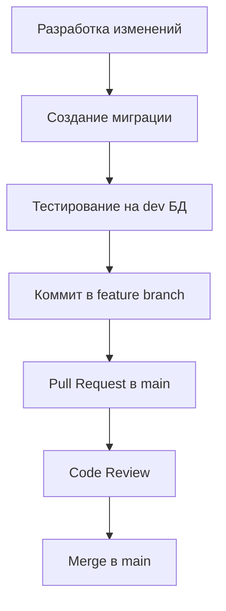
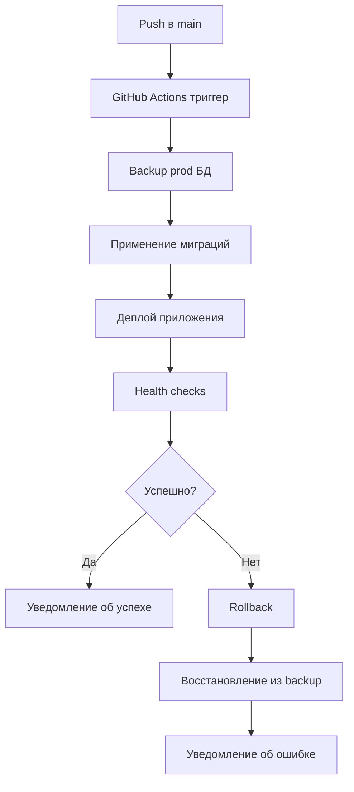

# ПЛАН АВТОМАТИЗАЦИИ CI/CD С МИГРАЦИЯМИ БД

## 🎯 Цель
Настроить автоматический процесс публикации релизов с безопасными миграциями базы данных через GitHub Actions.

## 🔄 Предлагаемый флоу релизов

### 1. Подготовка миграций в dev окружении


### 2. Автоматический деплой


## 📋 Компоненты для реализации

### 1. GitHub Actions Workflow
**Файл:** `.github/workflows/deploy-production.yml`

```yaml
name: Deploy to Production

on:
  push:
    branches: [main]
  workflow_dispatch: # Ручной запуск

jobs:
  deploy:
    runs-on: ubuntu-latest
    environment: production
    
    steps:
      - name: Checkout code
        uses: actions/checkout@v4
        
      - name: Setup Node.js
        uses: actions/setup-node@v4
        with:
          node-version: '18'
          cache: 'npm'
          
      - name: Install dependencies
        run: npm ci
        
      - name: Database backup
        run: |
          echo "Creating database backup..."
          # Команда для создания backup prod БД
          
      - name: Run database migrations
        run: |
          npx prisma migrate deploy
        env:
          DATABASE_URL: ${{ secrets.PROD_DATABASE_URL }}
          
      - name: Deploy application
        run: |
          # Команды для деплоя (например, Vercel)
          
      - name: Health check
        run: |
          # Проверка работоспособности приложения
          
      - name: Notify success
        if: success()
        run: |
          echo "Deployment successful!"
          
      - name: Rollback on failure
        if: failure()
        run: |
          echo "Deployment failed, initiating rollback..."
          # Команды для отката
```

### 2. Скрипты для управления БД

#### backup-database.sh
```bash
#!/bin/bash
# Создание backup продакшн БД
TIMESTAMP=$(date +"%Y%m%d_%H%M%S")
BACKUP_FILE="backup_${TIMESTAMP}.sql"

# Для PostgreSQL (Neon)
pg_dump $PROD_DATABASE_URL > $BACKUP_FILE

echo "Backup created: $BACKUP_FILE"
```

#### restore-database.sh
```bash
#!/bin/bash
# Восстановление БД из backup
BACKUP_FILE=$1

if [ -z "$BACKUP_FILE" ]; then
    echo "Usage: $0 <backup_file>"
    exit 1
fi

# Восстановление из backup
psql $PROD_DATABASE_URL < $BACKUP_FILE

echo "Database restored from: $BACKUP_FILE"
```

### 3. Конфигурация окружений

#### .env.production
```env
# Production environment variables
DATABASE_URL="postgresql://..."
NEXT_PUBLIC_CLERK_PUBLISHABLE_KEY="pk_live_..."
CLERK_SECRET_KEY="sk_live_..."
NEXT_PUBLIC_CLERK_SIGN_IN_URL="/login"
NEXT_PUBLIC_CLERK_SIGN_UP_URL="/register"
NEXT_PUBLIC_CLERK_AFTER_SIGN_IN_URL="/"
NEXT_PUBLIC_CLERK_AFTER_SIGN_UP_URL="/"
```

## 🔒 Безопасность миграций

### 1. Стратегия безопасных миграций
- **Backward compatible изменения** - новые колонки с DEFAULT значениями
- **Поэтапные изменения** - разбивка сложных миграций на этапы
- **Тестирование на копии prod данных** - создание staging окружения

### 2. Проверки перед миграцией
```sql
-- Проверка размера таблиц
SELECT 
    schemaname,
    tablename,
    attname,
    n_distinct,
    correlation
FROM pg_stats
WHERE schemaname = 'public';

-- Проверка активных соединений
SELECT count(*) FROM pg_stat_activity;
```

### 3. Мониторинг миграций
- **Время выполнения** - логирование длительности миграций
- **Блокировки** - мониторинг lock'ов во время миграции
- **Размер БД** - отслеживание изменений размера

## 📊 Мониторинг и алерты

### 1. Health checks
```javascript
// pages/api/health.js
export default async function handler(req, res) {
  try {
    // Проверка подключения к БД
    await prisma.$queryRaw`SELECT 1`;
    
    res.status(200).json({
      status: 'healthy',
      timestamp: new Date().toISOString(),
      database: 'connected'
    });
  } catch (error) {
    res.status(500).json({
      status: 'unhealthy',
      error: error.message
    });
  }
}
```

### 2. Уведомления
- **Slack/Discord** - уведомления о статусе деплоя
- **Email** - критические ошибки
- **GitHub** - статус в PR/коммитах

## 🚀 Поэтапная реализация

### Этап 1: Базовая автоматизация (1-2 дня)
- [ ] Создание GitHub Actions workflow
- [ ] Настройка secrets в GitHub
- [ ] Базовые скрипты backup/restore
- [ ] Тестирование на staging

### Этап 2: Расширенная безопасность (2-3 дня)
- [ ] Автоматические backup'ы
- [ ] Health checks
- [ ] Rollback механизмы
- [ ] Мониторинг миграций

### Этап 3: Продвинутые возможности (3-5 дней)
- [ ] Blue-green deployments
- [ ] Canary releases
- [ ] Автоматические performance тесты
- [ ] Интеграция с мониторингом

## 🔧 Необходимые инструменты

### GitHub Secrets
```
PROD_DATABASE_URL - URL продакшн БД
CLERK_SECRET_KEY - Clerk секретный ключ
VERCEL_TOKEN - токен для деплоя (если используется Vercel)
SLACK_WEBHOOK - для уведомлений
```

### Дополнительные сервисы
- **Vercel/Netlify** - хостинг приложения
- **Neon** - PostgreSQL БД
- **GitHub Actions** - CI/CD
- **Slack/Discord** - уведомления

## 📝 Чеклист готовности к продакшену

- [ ] Все миграции протестированы на dev
- [ ] Backup стратегия настроена
- [ ] Health checks работают
- [ ] Мониторинг настроен
- [ ] Rollback процедуры протестированы
- [ ] Команда знает процедуры экстренного реагирования
- [ ] Документация обновлена

## 🎯 Следующие шаги

1. **Создать staging окружение** - копия prod для тестирования
2. **Настроить GitHub Actions** - базовый workflow
3. **Протестировать миграции** - на staging данных
4. **Настроить мониторинг** - health checks и алерты
5. **Документировать процессы** - runbook для команды

---

*Этот план обеспечивает безопасный и автоматизированный процесс релизов с минимальными рисками для продакшн данных.*