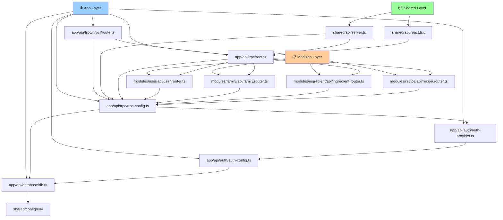

# Server Layer Refactoring Plan

## Цель
Устранить слой `server` и перенести его компоненты в `app/api` и `modules`, избегая импортов из modules в shared.

## Текущая проблема
- Слой `server` нарушает принципы чистой архитектуры
- При переносе роутеров в modules возникают импорты из modules в shared
- Необходимо сохранить безопасность слоев

## Выбранное решение
Перенос всего server слоя в `app/api`, роутеры в соответствующие modules.

## Структура миграции

### Исходная структура
```
src/server/
├── api/
│   ├── trpc.ts
│   ├── root.ts
│   └── routers/
│       ├── user.ts
│       ├── family.ts
│       ├── ingredient.ts
│       └── recipe.ts
├── auth/
│   ├── config.ts
│   └── index.ts
└── db.ts
```

### Целевая структура
```
src/
├── app/api/
│   ├── auth/
│   │   ├── auth-config.ts      # из server/auth/config.ts
│   │   ├── auth-provider.ts    # из server/auth/index.ts
│   │   └── [...nextauth]/route.ts
│   ├── database/
│   │   └── db.ts              # из server/db.ts
│   └── trpc/
│       ├── trpc-config.ts     # из server/api/trpc.ts
│       ├── root.ts            # из server/api/root.ts
│       └── [trpc]/route.ts
├── modules/
│   ├── user/api/user.router.ts    # из server/api/routers/user.ts
│   ├── family/api/family.router.ts
│   ├── ingredient/api/ingredient.router.ts
│   └── recipe/api/recipe.router.ts
└── shared/api/
    ├── server.ts              # обновить импорты
    └── react.tsx              # обновить импорты
```

## План выполнения

### Этап 1: Создание структуры папок
1. Создать `app/api/auth/`
2. Создать `app/api/database/`
3. Создать `app/api/trpc/`
4. Создать `modules/*/api/` для каждого модуля

### Этап 2: Перенос базовых компонентов
1. `server/db.ts` → `app/api/database/db.ts`
2. `server/auth/config.ts` → `app/api/auth/auth-config.ts`
3. `server/auth/index.ts` → `app/api/auth/auth-provider.ts`
4. `server/api/trpc.ts` → `app/api/trpc/trpc-config.ts`
5. `server/api/root.ts` → `app/api/trpc/root.ts`

### Этап 3: Перенос роутеров
1. `server/api/routers/user.ts` → `modules/user/api/user.router.ts`
2. `server/api/routers/family.ts` → `modules/family/api/family.router.ts`
3. `server/api/routers/ingredient.ts` → `modules/ingredient/api/ingredient.router.ts`
4. `server/api/routers/recipe.ts` → `modules/recipe/api/recipe.router.ts`

### Этап 4: Обновление импортов

#### app/api/trpc/root.ts
```typescript
import { createCallerFactory, createTRPCRouter } from "./trpc-config";
import { userRouter } from "~/modules/user/api/user.router";
import { familyRouter } from "~/modules/family/api/family.router";
import { ingredientRouter } from "~/modules/ingredient/api/ingredient.router";
import { recipeRouter } from "~/modules/recipe/api/recipe.router";
```

#### shared/api/server.ts
```typescript
import { createCaller, type AppRouter } from "~/app/api/trpc/root";
import { createTRPCContext } from "~/app/api/trpc/trpc-config";
```

#### shared/api/react.tsx
```typescript
import { type AppRouter } from "~/app/api/trpc/root";
```

#### app/api/trpc/[trpc]/route.ts
```typescript
import { appRouter } from "~/app/api/trpc/root";
import { createTRPCContext } from "~/app/api/trpc/trpc-config";
```

#### app/api/auth/[...nextauth]/route.ts
```typescript
import { handlers } from "~/app/api/auth/auth-provider";
```

#### Роутеры в modules
```typescript
// modules/user/api/user.router.ts
import { createTRPCRouter, protectedProcedure } from '~/app/api/trpc/trpc-config';
```

### Этап 5: Обновление конфигурации

#### app/api/auth/auth-config.ts
```typescript
import { db } from "~/app/api/database/db";
```

#### app/api/trpc/trpc-config.ts
```typescript
import { auth } from "~/app/api/auth/auth-provider";
import { db } from "~/app/api/database/db";
```

### Этап 6: Удаление старых файлов
1. Удалить папку `src/server/`
2. Проверить отсутствие ссылок на старые пути

## Преимущества решения

1. ✅ **Устранены импорты из modules в shared**
2. ✅ **API код логично размещен в app/api**
3. ✅ **Модули изолированы и содержат только свои роутеры**
4. ✅ **Соответствует Next.js конвенциям**
5. ✅ **Сохранена безопасность архитектурных слоев**
6. ✅ **Легко тестировать каждый модуль отдельно**

## Диаграмма зависимостей после рефакторинга



## Критерии готовности

- [ ] Все файлы из server/ перенесены
- [ ] Все импорты обновлены
- [ ] Приложение компилируется без ошибок
- [ ] Все API эндпоинты работают
- [ ] Аутентификация функционирует
- [ ] Тесты проходят
- [ ] Папка server/ удалена

## Риски и митигация

1. **Риск**: Поломка импортов
   **Митигация**: Поэтапное выполнение с проверкой компиляции

2. **Риск**: Нарушение работы API
   **Митигация**: Тестирование каждого эндпоинта после миграции

3. **Риск**: Проблемы с аутентификацией
   **Митигация**: Отдельное тестирование auth компонентов

## Статус
- [x] Планирование завершено
- [ ] Готов к выполнению builder агентом